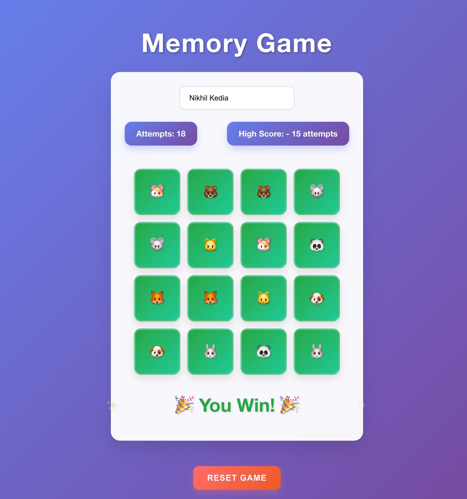

# React Memory Game

A fun and engaging memory card matching game built with **React 19**, **TypeScript**, and **Vite**.



## 🎮 Overview

This memory card game is designed to test and enhance memory skills. The objective is to flip cards and find matching pairs with the fewest attempts. The application tracks the user's attempts and stores the best score in local storage to provide a competitive aspect.

## 🚀 Tech Stack

- **React 19** - Latest React with concurrent features
- **TypeScript** - Type-safe development
- **Vite** - Fast build tool and dev server
- **CSS** - Custom styling with responsive design
- **GitHub Pages** - Deployment platform

## 🏗️ App Structure

The app consists of two main components:

1. **Card Component** (`Card.tsx`)
2. **App Component** (`App.tsx`)

## 🧩 Components and Their Roles

### Card Component (`Card.tsx`)

The `Card` component is a stateless functional component that displays each card in the game. It receives three props:

- **card**: An object containing the card's content, ID, and match status.
- **onClick**: A function to handle the card click event.
- **isFlipped**: A boolean indicating whether the card is flipped.

The `Card` component uses `React.memo` to prevent unnecessary re-renders, improving performance. When the card is clicked, it calls the `onClick` function unless it is already flipped.

### App Component (`App.tsx`)

The `App` component is the main component that manages the game state and logic. It contains several state variables and functions:

- **State Variables**:

  - `deck`: An array representing the deck of cards.
  - `flippedCards`: An array storing the currently flipped cards.
  - `matchedPairs`: A counter for the number of matched pairs.
  - `attempts`: A counter for the number of attempts made.
  - `name`: The player's name.
  - `highScore`: An object storing the best score and player's name, retrieved from local storage.
  - `gameEnded`: A boolean indicating if the game has ended.

- **Functions**:
  - `generateDeck()`: A helper function to create and shuffle the deck of cards.
  - `handleCardClick(card)`: A callback function handles the card click event. It adds the clicked card to `flippedCards` if it's not already flipped and the game hasn't ended.
  - `resetGame()`: A function to reset the game state, generate a new deck, and reset counters.

The component also includes several `useEffect` hooks:

1. To handle the game logic when two cards are flipped. It increments the attempt counter and checks if the two flipped cards match. If they do, it marks them as matched. The `flippedCards` array is reset after a short delay.
2. To update the high score in local storage if the player achieves a new best score.
3. **New:** To detect when only two unmatched cards are left. In this case, the app automatically flips the last two cards, increments the attempt count, and ends the game after a short delay, showing the win message and updating the high score if appropriate.

## 🎨 Styling

The styling is handled using CSS in two files:

### Card Styles (`Card.css`)

The card styles define the appearance of the cards, including their size, font, background color, and hover effects. It also includes responsive styles for different screen sizes.

### App Styles (`App.css`)

The app styles define the layout and appearance of the overall application, including the board layout, input fields, score display, and reset button.

## 🎯 Game Logic

The game starts with a shuffled deck of cards. The player flips cards to find matching pairs. The game keeps track of the number of attempts and updates the high score if the player achieves a new best score.

- When two cards are flipped, the app checks if they match. If they do, they are marked as matched.
- **When only two unmatched cards remain, the app automatically flips them, increments the attempt count, and ends the game, displaying the win message.**
- The game ends when all pairs are matched, and a winning message is displayed.
- The player can reset the game anytime to start a new game with a shuffled deck.

## 🔧 Development

### Prerequisites

- Node.js 18+
- npm or yarn

### Running the App

1. **Clone the repository**:

   ```bash
   git clone https://github.com/inikhilkedia/React-Memory-Game.git
   cd React-Memory-Game
   ```

2. **Install dependencies**:

   ```bash
   npm install
   ```

3. **Start the development server**:

   ```bash
   npm run dev
   ```

4. **Open the app** in your browser:
   ```
   http://localhost:3000
   ```

### Build for Production

```bash
npm run build
```

### Preview Production Build

```bash
npm run preview
```

## 🚀 Deployment

The app is automatically deployed to GitHub Pages when changes are pushed to the main branch.

### Manual Deployment

```bash
npm run deploy
```

## 🔄 Migration from Create React App

This project was successfully migrated from Create React App (CRA) to Vite for:

- **Faster builds** and hot reloads
- **Modern tooling** with better performance
- **Up-to-date dependencies** without security vulnerabilities
- **Simpler configuration** and maintenance

## 📱 Features

- ✅ Responsive design for all screen sizes
- ✅ Local storage for high score persistence
- ✅ TypeScript for type safety
- ✅ Fast development with Vite
- ✅ Automatic card matching detection
- ✅ Competitive scoring system

## 🎯 Live Demo

Play the game online: [React Memory Game](https://inikhilkedia.github.io/React-Memory-Game/)

---

**Built with ❤️ by Nikhil Kedia**
